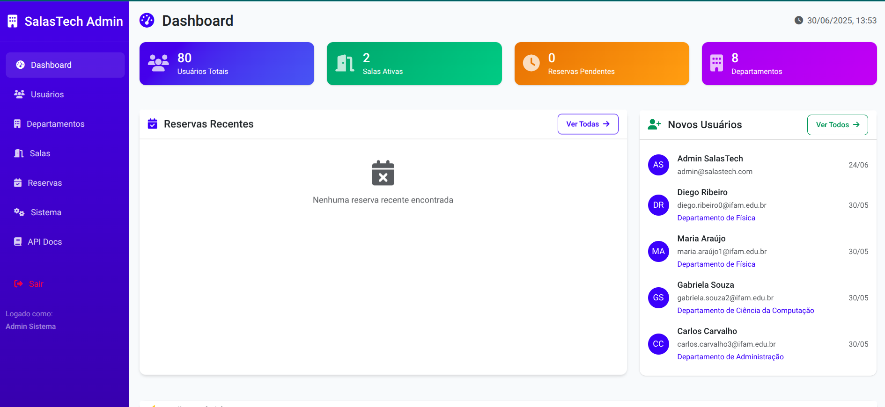

# SalasTech - Sistema de Gerenciamento de Salas

SalasTech é um sistema completo para gerenciamento de salas e reservas, desenvolvido com FastAPI e seguindo a arquitetura MVC.



## Funcionalidades

- Gerenciamento de usuários com diferentes níveis de acesso
- Gerenciamento de departamentos
- Cadastro e manutenção de salas e recursos
- Sistema de reservas com regras de negócio
- Aprovação automática ou manual de reservas
- Relatórios e estatísticas de uso
- Interface administrativa e API REST
- Administração de usuários via scripts

## Tecnologias

- **Backend**: FastAPI, SQLAlchemy, Pydantic
- **Banco de Dados**: SQLite (desenvolvimento), PostgreSQL (produção)
- **Autenticação**: JWT
- **Testes**: Pytest (unidade, integração e e2e)
- **Migrações**: Alembic

## Documentação

A documentação completa está disponível no diretório `docs/`:

- [API](docs/API.md): Documentação da API REST
- [Arquitetura](docs/Arquitetura.md): Visão geral da arquitetura do sistema
- [Instalação](docs/Instalacao.md): Guia de instalação e configuração
- [Manual do Usuário](docs/ManualUsuario.md): Manual para usuários finais
- [Regras de Negócio](docs/RegraNegocio.md): Regras de negócio implementadas
- [Regras do Sistema](docs/RegrasDeSistema.md): Regras técnicas do sistema
- [Plano de Testes](docs/plano_de_testes.md): Estratégia e casos de teste
- [Contribuição](docs/Contribuicao.md): Guia para contribuidores
- [API Exemplos](docs/API_Exemplos.md): Exemplos práticos de uso da API
- [Migração e Segurança](docs/MigracaoSeguranca.md): Informações sobre migrações e segurança

## Instalação Rápida

1. Clone o repositório:

   ```bash
   git clone https://github.com/jpedrops092/SalasTech-backend.git
   cd SalasTech-backend
   ```

2. Crie e ative um ambiente virtual:

   ```bash
   python -m venv venv
   source venv/bin/activate  # Linux/macOS
   venv\Scripts\activate     # Windows
   ```

3. Instale as dependências:

   ```bash
   pip install -r requirements.txt
   ```

   Ou usando o arquivo pyproject.toml:

   ```bash
   pip install -e .
   ```

4. Configure o ambiente:

   ```bash
   cp .env.example .env
   # Edite o arquivo .env com suas configurações
   ```

5. Execute as migrações do banco de dados:

   ```bash
   python -m migrations.migrate
   ```

6. Crie um usuário administrador:

   ```bash
   python manage_admins.py
   ```

7. Inicie o servidor:

   ```bash
   uvicorn app.main:app --reload
   ```

8. Acesse a aplicação:

   - API: http://localhost:8000/api
   - Documentação da API: http://localhost:8000/api/docs
   - Painel Admin: http://localhost:8000/admin

## Administração de Usuários

Para gerenciar usuários administradores, use o script `manage_admins.py`:

```bash
# Gerenciar administradores (criar, listar, editar, excluir)
python manage_admins.py
```

Este script permite:

- Criar novos administradores
- Listar administradores existentes
- Editar informações de administradores
- Excluir administradores

## Backup do Banco de Dados

O sistema possui um script para backup do banco de dados:

```bash
# Criar backup do banco de dados
python scripts/backup_database.py
```

Os backups são armazenados no diretório `backups/` com timestamp.

## Estrutura do Projeto

```
SalasTech-backend/
├── app/                    # Aplicação principal
│   ├── admin/                # Interface administrativa
│   ├── controllers/          # Controladores da API
│   │   └── api/                # Endpoints da API REST
│   ├── core/                 # Configurações e dependências
│   │   └── security/           # Autenticação e segurança
│   ├── models/               # Modelos de dados
│   ├── serializers/          # Serialização de dados
│   └── utils/                # Utilitários
├── backups/                # Backups do banco de dados
├── docs/                   # Documentação
├── logs/                   # Arquivos de log
├── migrations/             # Sistema de migrações
│   └── versions/             # Versões das migrações
├── scripts/                # Scripts de utilidade
└── tests/                  # Testes automatizados
    ├── e2e/                  # Testes de ponta a ponta
    ├── integration/          # Testes de integração
    └── unit/                 # Testes unitários
```

## Desenvolvimento

Para configurar o ambiente de desenvolvimento, consulte o [Guia de Contribuição](docs/Contribuicao.md).

## Migrações

O sistema utiliza Alembic para gerenciar migrações do banco de dados:

```bash
# Verificar migrações pendentes
python -m migrations.check_migrations

# Aplicar migrações
python -m migrations.migrate

# Criar uma nova migração
python -m migrations.alembic_utils revision -m "descrição da migração"
```

## Testes

Execute os testes com:

```bash
# Executar todos os testes
pytest

# Executar testes específicos
pytest tests/unit/
pytest tests/integration/
pytest tests/e2e/
```

Para verificar a cobertura de código:

```bash
pytest --cov=app
```

## Licença

Este projeto está licenciado sob a licença MIT - veja o arquivo [LICENSE](LICENSE) para detalhes.

## Contato

Para dúvidas ou sugestões, entre em contato com:

- Email: suporte@salastech.com.br
- Desenvolvedor: João Pedro (jpcode092@ifam.edu.br)
